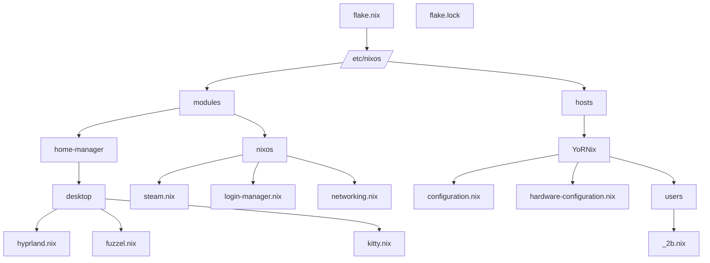

Nixos Configuration Files

```mermaid
graph TD
  FLAKE[flake.nix]
  LOCK[flake.lock]

  FLAKE --> ETCNIXOS[/etc/nixos/]
  ETCNIXOS --> MODULES[modules]
  ETCNIXOS --> HOSTS[hosts]

  MODULES --> HM[home-manager]
  HM --> HM_DESKTOP[desktop]
  HM_DESKTOP --> HYPR[hyprland.nix]
  HM_DESKTOP --> FUZZEL[fuzzel.nix]
  HM_DESKTOP --> KITTY[kitty.nix]
  
  MODULES --> NIXOS[nixos]
  NIXOS --> STEAM[steam.nix]
  NIXOS --> LOGIN[login-manager.nix]
  NIXOS --> NETWORK[networking.nix]

  HOSTS --> YORNIX[YoRNix]
  YORNIX --> CONF[configuration.nix]
  YORNIX --> HARD[hardware-configuration.nix]
  YORNIX --> USERS[users]
  USERS --> USER2B[_2b.nix]
```
